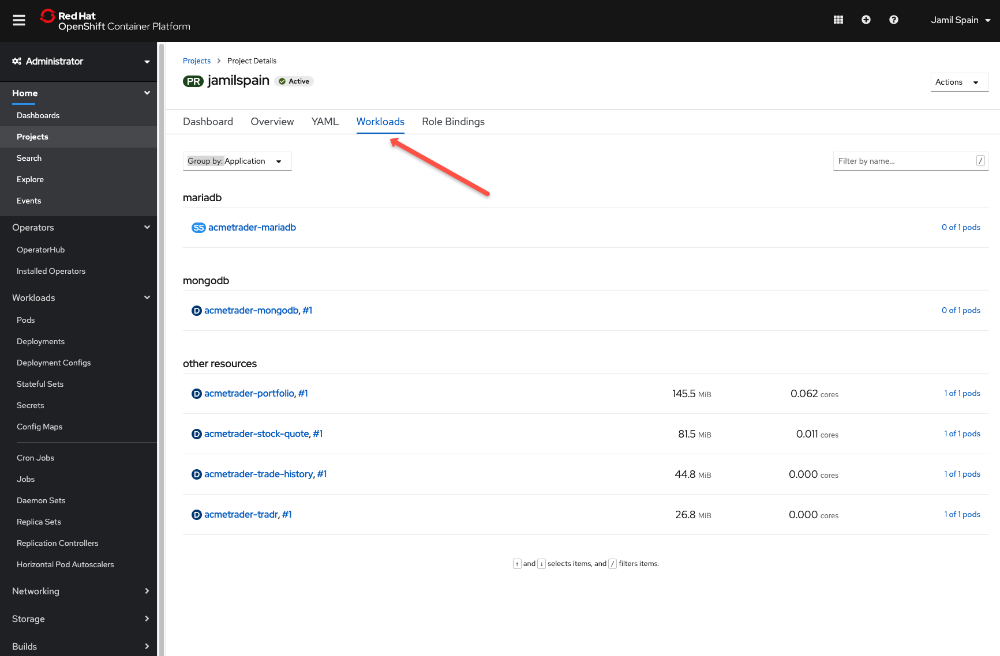
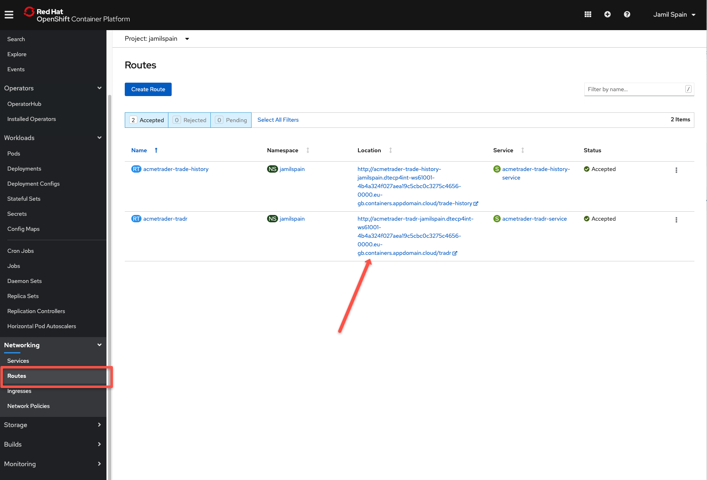

# Lab - Working with Openshift Console and HELM CLI.

In this lab, you will get acquainted with the command line and how to publish Helm Applications to the OpenShift Console with Helm 3 CLI. For more information on this topic, please see the OpenShift Documentation here: <https://www.openshift.com/blog/openshift-4-3-deploy-applications-with-helm-3>

## Downloading the Scenario Lab Assets

```
helm dependency update
```

```
Hang tight while we grab the latest from your chart repositories...
...Successfully got an update from the "stable" chart repository
Update Complete. ⎈Happy Helming!⎈
Saving 3 charts
Downloading mariadb from repo https://charts.bitnami.com/bitnami/
Downloading mongodb from repo https://charts.bitnami.com/bitnami/
Deleting outdated charts
```

```
helm3 install acmetrader --namespace jamilspain .
```

RESULTS:

```
NAME: acmetrader
LAST DEPLOYED: Thu Jun 25 02:29:57 2020
NAMESPACE: jamilspain
STATUS: deployed
REVISION: 1
NOTES:
Trader Lite V2.0 is deployed.

Run  the following command to get the URL of  the applications's UI:
 echo "http://"`oc get route acmetrader-tradr  -o jsonpath='{.spec.host }'`"/tradr"
```




