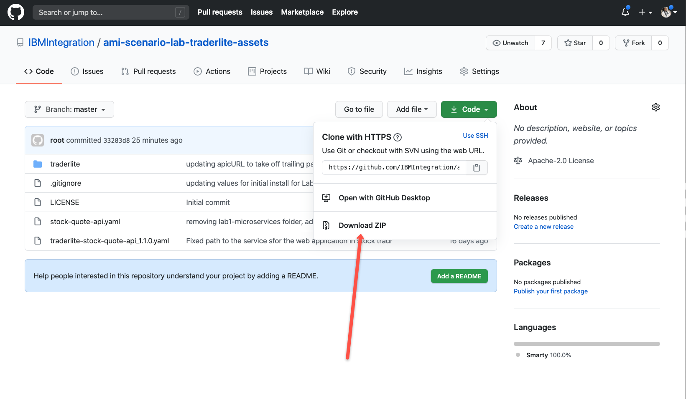

# Lab - Working with Openshift Console and HELM CLI.

In this lab, you will get acquainted with the command line and how to publish Helm Applications to the OpenShift Console with Helm 3 CLI. For more information on this topic, please see the OpenShift Documentation here: <https://www.openshift.com/blog/openshift-4-3-deploy-applications-with-helm-3>

## Downloading the Scenario Lab Assets

1. Browse to the following URL to get access to the lab assets: 

https://github.com/IBMIntegration/ami-scenario-lab-traderlite-assets

2. Use the **Download ZIP** button to copy the archive of hte repo locally to work with during the lab. 




3. Let's update the supporting charts that will be needed for this application to install.  There are two database charts that are dependencies.  By running the following command below, it will download

```
helm dependency update
```

Once this command runs, you should see the following output. 

```
Hang tight while we grab the latest from your chart repositories...
...Successfully got an update from the "stable" chart repository
Update Complete. ⎈Happy Helming!⎈
Saving 3 charts
Downloading mariadb from repo https://charts.bitnami.com/bitnami/
Downloading mongodb from repo https://charts.bitnami.com/bitnami/
Deleting outdated charts
```

4. Once we have the dependencies downloaded successfully for our application, it is now time to run the helm install command.  The syntax for helm3 install is below. 

```
helm install [release-name] --namespace [your project name]  [ path to root of chart folder]
```

For instance, from the root of the chart folder I can install the application release called "acemtrader" into my "jamilspain" project space. 

```
helm install acmetrader --namespace jamilspain .
```

RESULTS:

```
NAME: acmetrader
LAST DEPLOYED: Thu Jun 25 02:29:57 2020
NAMESPACE: jamilspain
STATUS: deployed
REVISION: 1
NOTES:
Trader Lite V2.0 is deployed.

Run  the following command to get the URL of  the applications's UI:
 echo "http://"`oc get route acmetrader-tradr  -o jsonpath='{.spec.host }'`"/tradr"
```


