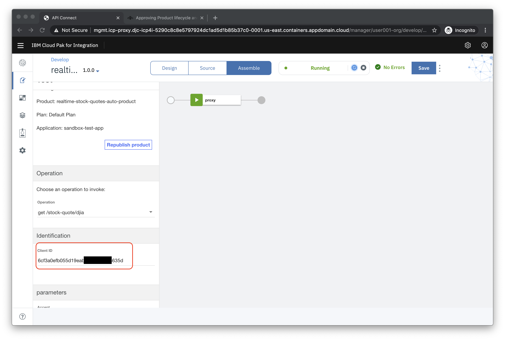

# Lab - Create, deploy and test a new API using the API Connect Developer Toolkit

In this lab you will create a new API using the OpenAPI definition of an existing RESTful web-service that gets realtime stock quotes. You will then test the deployed API by deploying the _IBM Trader Lite_ application which is a simple stock trading sample, written as a set of microservices. The app uses the API definition that you will create to get realtime stock quotes.

The architecture of the app is shown below:


- **Tradr** is a Node.js UI for the portfolio service

- The **portfolio** microservice sits at the center of the application. This microservice:
  - persists trade data using JDBC to a MariaDB database
  - invokes the **stock-quote** service that invokes an API defined in API Connect in CP4I to get stock quotes
  - calls the **trade-history** service to store trade data in a PostgreSQL database that can be queried for reporting purposes.
  - calls the **trade-history** service to get aggregated historical trade data.

This lab is broken up into the following steps:

1. [Download the OpenAPI definition file for the external Stock Quote service](#step-1-download-the-openapi-definition-file-for-the-external-stock-quote-service)

1. [Import the OpenAPI definition file into API Manager](#step-2-import-the-openapi-definition-file-into-api-manager)

1. [Configure the API](#step-3-configure-the-api)

1. [Test the API](#step-4-test-the-api)

1. [Setup Your Terminal / Command Prompt](#step-5-Setup-Your-Terminal-Command-Prompt)

1. [Create a new OpenShift project for the Trader Lite app](#step-6-create-a-new-openshift-project-for-the-trader-lite-application)

1. [Prepare for Installation](#step-7-prepare-for-installation)

1. [Install the Trader Lite app](#step-8-install-the-trader-lite-app)

1. [Verify that the Trader Lite app is calling your API successfully](#step-9-verify-that-the-trader-lite-app-is-calling-your-api-successfully)

1. [Summary](#summary)

## Step 1: Import the OpenAPI definition file for the external Stock Quote service

1.1 We have already imported the OpenAPI Definition you need into the Asset Repository ( see image below ). You will import the file directly from the Asset Repo when creating the API.


## Step 2: Import the OpenAPI definition file into API Manager

2.1 In a new browser tab open the CP4I **Platform Home** URL provided to you by your instructors.

2.2 Login with your **OpenLDAP** credentials

2.3 Click on **Skip Welcome**

2.4 Click on **View instances** and then click the link for API Connect


2.5 Select the **Cloud Dragons LDAP** OR **OpenLDAP** user repository


2.6 Login with your **OpenLDAP** username and password

2.7 Click on the **Develop APIs and Products tile**


2.8 Click **ADD->API**


2.9 On the next screen select **From asset repository** under **Import** and then click **Next**.


2.10 Now choose **Launch the asset repository** button from the popup window.


2.10a Now choose **Launch the asset repository** from your local file system and click **Next**.


2.10b Look for **TraderLite Stock Quote API** from the list of items and click **+**.


2.10c A confirmation message will appear confirmation the successful import from the Asset Repository. Now click **Next**.

2.11 **Do not** select **Activate API**. Click **Next**


2.12 The API should be imported successfully as shown below. Click **Edit API**.


## Step 3: Configure the API

After importing the existing API, the first step is to configure basic security before exposing it to other developers. By creating a client key you are able to identify the app using the services. Next, we will define the backend endpoints where the API is actually running. API Connect supports pointing to multiple backend endpoints to match your multiple build stage environments.

3.1 Scroll down in the Edit API screen and replace the **Host** address with `$(catalog.host)` to indicate that you want calls to the external API to go through API Connect.


3.2 Click **Save**

3.3 In the Edit API screen click **Security Definitions** in the left navigation

3.4 In the **Security Definition** section, click the **Add** button on the right. This will open a new view titled **API Security Definition**.

3.5 In the **Name** field, type `client-id`.

3.6 Under **Type**, choose **API Key**. This will reveal additional settings.

3.7 For **Located In** choose **Header**. For **Key Type** choose **Client ID**. Your screen should look like the image below.


3.8 Click the **Save** button to return to the **Security Definitions** section.

3.9 Click **Security** in the left menu. Click **Add**. Select the **client-id** as shown below and then click **Save**.


3.10 Next you'll the define the endpoint for the external API. Click on **Properties** in the left menu.

3.11 Click on the **target-url** property. Click **Add**.

3.12 Choose the **sandbox** catalog and for the URL copy and paste the following URL:

    https://cloud.iexapis.com/stable/stock/


3.13 Click **Save** to complete the configuration.

3.14 Click on the **openldap** property.


3.15 Choose **ADD** and choose the **sandbox** catalog and enter your **OpenLDAP** username that was provided to you. This will help us differentiate your specific API once we get to tracing. Click **Save** to complete the configuration.


3.16 Click on the **token** property.


3.17 Replace the token key that was provided at the beginning of class. Click **Save** to complete the configuration.


## Step 4: Test the API

In the API designer, you have the ability to test the API immediately after creation in the **Assemble** view.

4.1 On the top Navigation, click **Assemble**.


4.2 Click **invoke** in the flow designer. Note the window on the right with the configuration. The **invoke** node calls the **target-url** (ie the external service).


4.3 Verify you see the **URL** field to include the value listed below. This will read for the request path passed in by the caller as well by appending `$(request.path)` to the **URL**.

    https://cloud.iexapis.com/stable/stock/$(request.parameters.symbol)/quote?token=$(api.properties.token)


4.3 Click **Save**

4.4 Click the play icon as indicated in the image below.


4.5 Click **Activate API** to publish the API to the gateway for testing.


4.6 After the API is published, your screen should look like the image below.


4.7 Under **Operation** choose get **/stock-quote/djia**.

4.8 Note that your **client-id** is prefilled for you.

4.9 Scroll all the way to the bottom of the browser window and click **Invoke**.


4.10 If this is the first test of the API, you may see a certificate exception. Simply click on the URL and choose the option to proceed.

4.11 Go back to the test view and click **Invoke** again.

4.12 Now you should see a Response section with Status code 200 OK and the Body displaying the details of the Dow Industrial average.


4.13 Scroll up in the test view until you see the **Client ID**. Copy the value to to a local text file so it can be used in the Stock Trader application later (**Note:** this is a shortcut to the regular process of publishing the API and then subscribing to it as a consumer).



4.14 Next we'll get the endpoint for your API. Click on the **Home** icon (top left) and then click on the **Manage Catalogs** tile.


4.15 Click on the **Sandbox** tile.

4.16 Click on the **Settings** icon and then on **API Endpoints**. Copy the gateway URL and put it in the same file that you used for the **Client ID**


## Step 5: Setup Your Terminal / Command Prompt

5.1 In a separate browser tab go to the OpenShift console URL provided by your instructor for the cluster designated to run the Stock Trader Lite application for the workshop.

5.2 Click on your username in the upper right and select **Copy Login Command\***


5.3 You are prompted to login to the OpenShift console again. Repeat the same login procedure above to login.

5.4 Click the **Display Token** link.

5.5 Copy the contents of the field **Log in with this token** to the clipboard. It provides a login command with a valid token for your username.

5.6 Paste the _oc login_ command in your terminal or command prompt and run it.

## Step 6: Updating the the Stock Trader Lite application in your Project Space

6.1 Verify that you are in your project namespace by running the following command.

```
 oc project [my-project-name]
```

## Step 7: Install/Update the Stock Trader Lite application

7.1 From the terminal/command prompt, browse to the directory where you originally downloaded the chart.

7.2a If you still have the application installed from Lab 1, then run the following command to republish the existing applcation with the new information from API Connect.

** If you called your helm release something other than traderlite, please use your name**

```
helm upgrade traderlite  --set stockQuoteMicroservice.apic.url="[API GATEWAY URL]" --set stockQuoteMicroservice.apic.clientId="[CLIENT ID]" ../traderlite
```

The results of thie

7.2b If this is a new or re-install, then use the following command below to set these variables with the information from API Connect.

```
helm install traderlite  --set stockQuoteMicroservice.apic.url="[API GATEWAY URL]" --set stockQuoteMicroservice.apic.clientId="[CLIENT ID]"  --namespace [YOUR OPENSHIFT PROJECT NAME]  .
```

7.4 Run the following command to get a list of running pods

```
oc get pods
```

7.5 You can also see the status of the install by going to your Openshift Console and viewing the **Workloads** Link for your Project.

## Step 8: Verify that the Trader Lite app is calling your API successfully

You will verify the configuration that you created that points at the API you created in API Connect.

8.1 Browse with your Web Browser to your Stock Tradr Web Application.

8.2 Log in using the username `stock` and the password `trader`


8.3 If the DJIA summary has data then you know that the API you created in API Connect is working !


## Summary

Congratulations ! You successfully completed the following key steps in this lab:

- Created an API by importing an OpenAPI definition for an existing REST service.
- Configured a ClientID/API Key for security set up a proxy to the existing API.
- Tested the API in the API Connect developer toolkit.
- Deployed the Trader Lite app and configured it to use the API you created.
- Tested the Trader Lite app to make sure it successfully uses your API.
