# Lab - Sync Salesforce data using IBM App Connect Enterprise

In this lab you will create an App Connect flow to sync client data in the **IBM Trader Lite** app to Salesforce. This will occur whenever a user of the **IBM Trader Lite** app creates a portfolio for a new client or reads the data of an existing client.

The architecture of the app is shown below:


The **portfolio** microservice invokes the REST endpoint of the new flow whenever a new client is created or read by the app and this results in a new contact being created in, or read from Salesforce.

This lab is broken up into the following sections:

1. [Sign up for Salesforce Developer Edition](#section-1-sign-up-for-salesforce-developer-edition)

1. [Create a Salesforce Connected App](#section-2-create-a-salesforce-connected-app)

1. [Setup connectivity to Salesforce in App Connect Designer](#section-3-setup-connectivity-to-salesforce-in-app-connect-designer)

1. [Create the flow in App Connect Designer](#section-4-create-the-flow-in-app-connect-designer)

1. [Save your Salesforce credentials as an OpenShift secret](#section-5-save-your-salesforce-credentials-as-an-openshift-secret)

1. [Create an Integration Server instance and deploy your flow](#section-6-create-an-integration-server-instance-and-deploy-your-flow)

1. [Get the REST endpoint of your App Connect Flow](#section-7-get-the-rest-endpoint-of-your-app-connect-flow)

1. [Test your App Connect Flow with Trader Lite](#section-8-test-your-app-connect-flow-with-trader-lite)

1. [Summary](#summary)

## Section 1: Sign up for Salesforce Developer Edition

1.1 In your browser go to the following URL to sign up for Salesforce Developer Edition - a full featured version of the Salesforce Lightning Platform. **Note:** If you already have access to the Salesforce Developer Edition or a paid version of Salesforce, skip to **Step 2**.

[Salesforce Developer Edition signup](https://developer.salesforce.com/signup)

1.2 Enter the required information and follow the prompts to complete the signup process.

## Section 2: Create a Salesforce Connected App

In this section you'll create a _Connected App_ in Salesforce so that the App Connect flow that you create later will be able to access your Salesforce data.

2.1 Login to [Salesforce](https://www.salesforce.com)

2.2 Click on your avatar (top right) and select **Switch to Salesforce Classic** from the context menu.


2.3 Click on **Setup**.

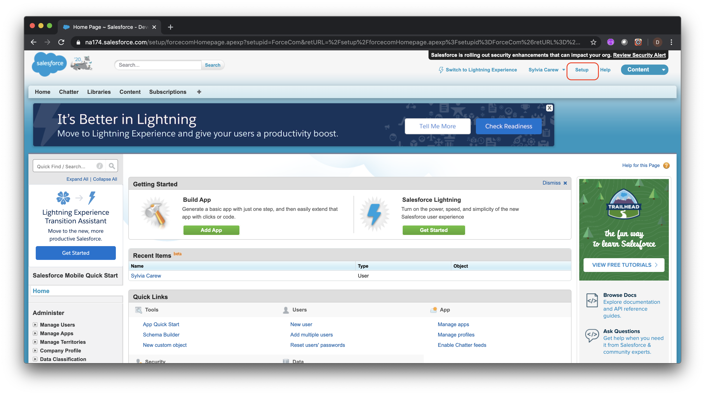

2.4 In the left navigation area, scroll down to the **Build** section, expand **Create** and click on **Apps**

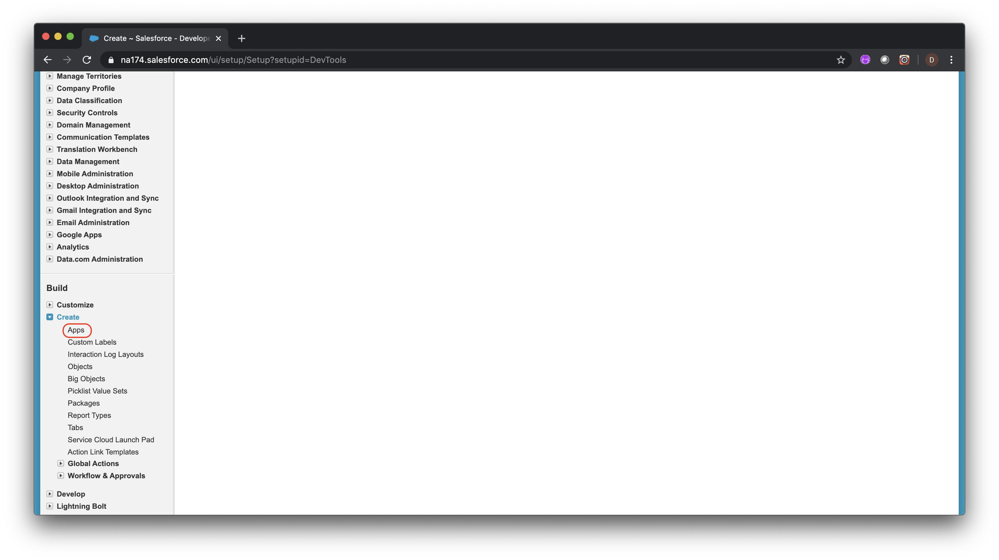

2.5 Scroll down to the **Connected Apps** section and click on **New**


2.6 Fill in the required values for a new Connected App

a. Set the **Connected App Name** property to `IBM App Connect`

b. Set the **API Name** to `IBM_App_Connect`

c. Enter your email address as the **Contact Email**


2.7 Configure the OAuth settings

- Select the **Enable OAuth Setting** check box.

- Set the **Callback URL** to `https://www.ibm.com`

- Under **Selected OAuth Scopes** select **Access and manage your data (api)** and click the arrow under the **Add** label

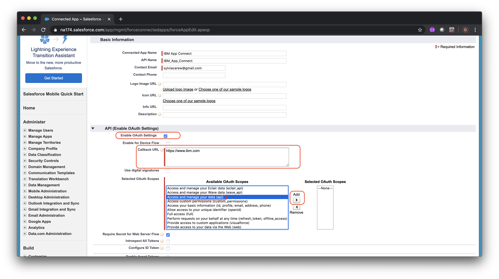

2.8 Scroll down to the bottom of the web page and click **Save**

2.9 Copy the **Consumer Key** and **Consumer Secret** to a text file. You will need them later to connect to Salesforce

2.10 Check your email for the email address that you use as your Salesforce username. You should have received an email from Salesforce with the subject **Your new Salesforce security token**. Copy the **Security Token** to the same text file that you used for the **Consumer Key** and **Consumer Secret**


2.11 If you haven't received the email do the following from Salesforce:

- Click on your user name and select **My Settings**
- On the left under the **Personal** section click on **Reset My Security Token** and check your email again.

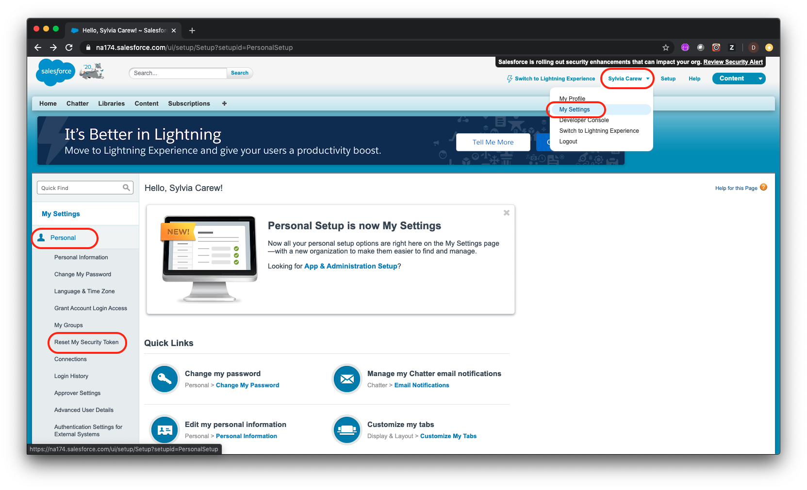

## Section 3: Setup connectivity to Salesforce in App Connect Designer

App Connect Designer is a component of Cloud Pak for Integration that provides an authoring environment in which you can create, test, and share flows for an API. You can share your flows by using the export and import functions, or by adding them to an Asset Repository for reuse. **Note** You will be sharing the IBM Cloud Pak for Integration cluster with other students so you will see their work as you navigate through the tool. You will use a naming scheme for the artifacts that you create that starts with the username assigned to you by the instructors (e.g. _user005_).

3.1 In a new browser tab open the CP4I **Platform Home** URL provided to you by your instructors.

3.2 Login with your _user???_ credentials if prompted

3.3 Click on **Skip Welcome**

3.4 Click on **View instances** and then click the link for **App Connect Designer**


3.5 Click the **Settings** icon and then select **Catalog**


3.6 Expand **Salesforce** .If there are existing connections shown in a drop down list select **Add a new account ...** from that list.

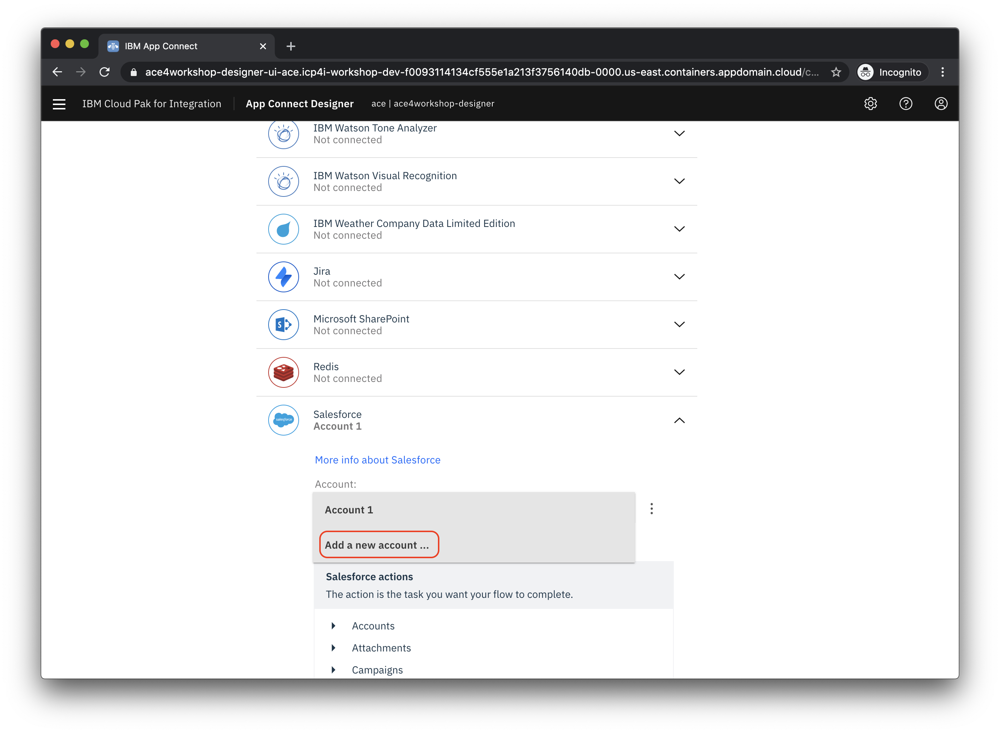

**Note** If there are no existing connection shown click on **Connect**

3.7 Enter the following values referring to the text file from the previous section where you saved your Salesforce credentials.

- For the **Login URL** enter `https://login.salesforce.com`

- For the **Username** enter the email you use to login to Salesforce

- For the **Password** enter the password you use to login to Salesforce. Then append the value of the **Security Token** (that you saved in the previous section) to the password. For example if your password is `foo` and your security token is `bar` you would enter `foobar` into the password field.

- For the **Client Id** copy and past the value of the **Consumer Key** (that you saved in the previous section).

- For the **Client Secret** copy and past the value of the **Consumer Secret** (that you saved in the previous section).

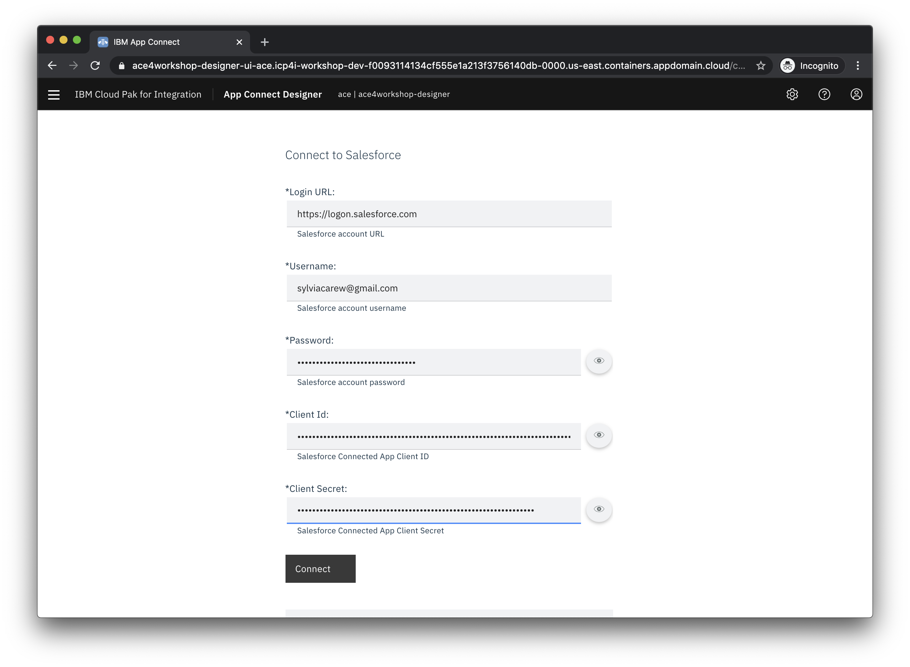

3.8 Click on **Connect**. The connection will be given a default name of the form _Account n_. Click on the 3 vertical dots next to the connection name and select **Rename Account**

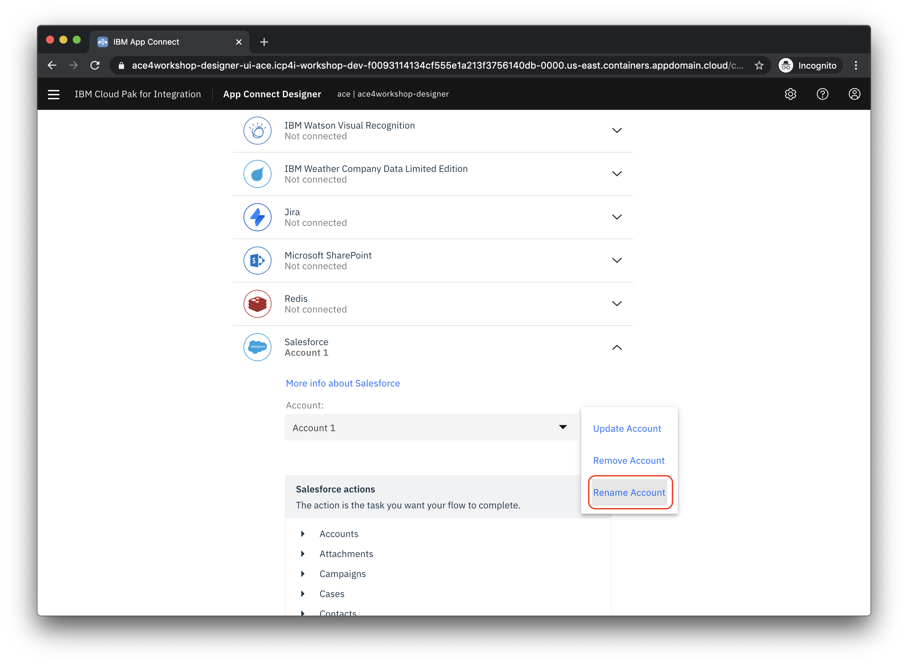

3.9 Enter the username you used to login to App Connect Designer as the new account name (e.g. _user005_) and click on **Rename Account**.

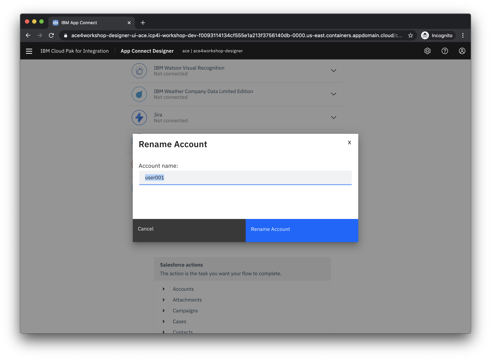

## Section 4: Create the flow in App Connect Designer

4.1 In App Connect Designer, click the **Settings** icon and then select **Dashboard**

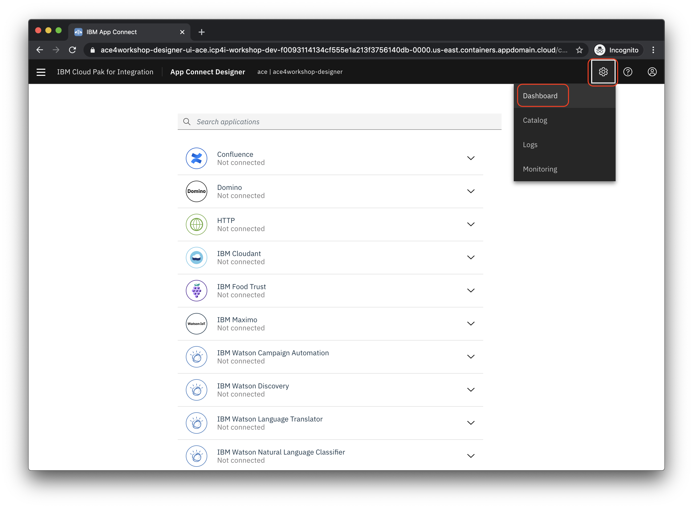

4.2 Click **New** and select **Flows for an API**


4.3 Name the flow `user???sf` where _user???_ is the username assigned to you (e.g. _user005sf_). Name the model `Client`

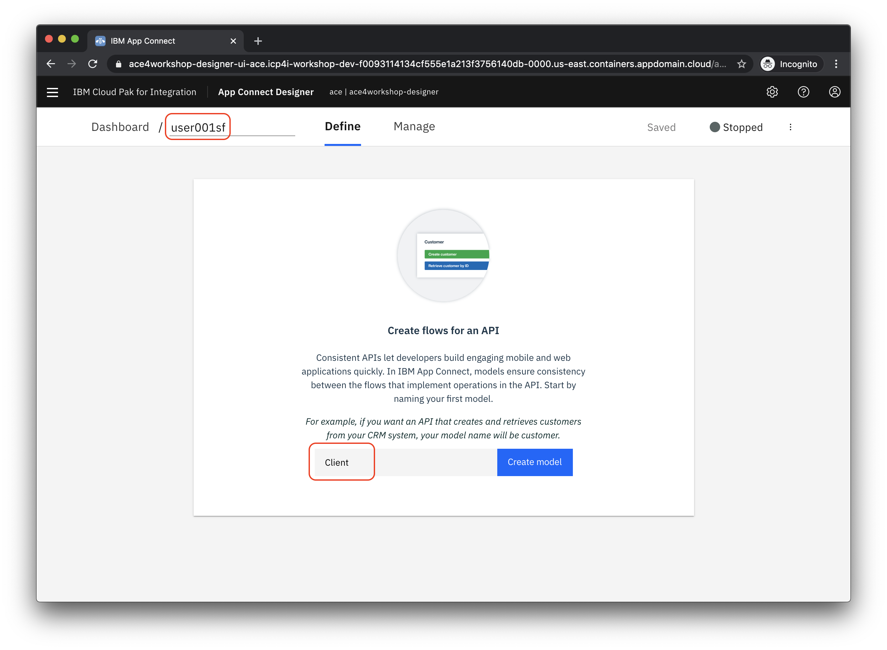

4.4 Click **Create Model**

4.5 Next you will add the properties of the input data for your flow. _Note:_ Name them exactly as instructed (including matching case) so that your flow will work with the _Stock Trader Lite_ app.

- Enter `ClientId` as the first property and then click **Add property +**

- Enter `FirstName` as the next property and then click **Add property +**

- Enter `LastName` as the next property and then click **Add property +**

- Enter `Email` as the next property

- Enter `MobilePhone` as the next property

When you're done the screen should look like the following:

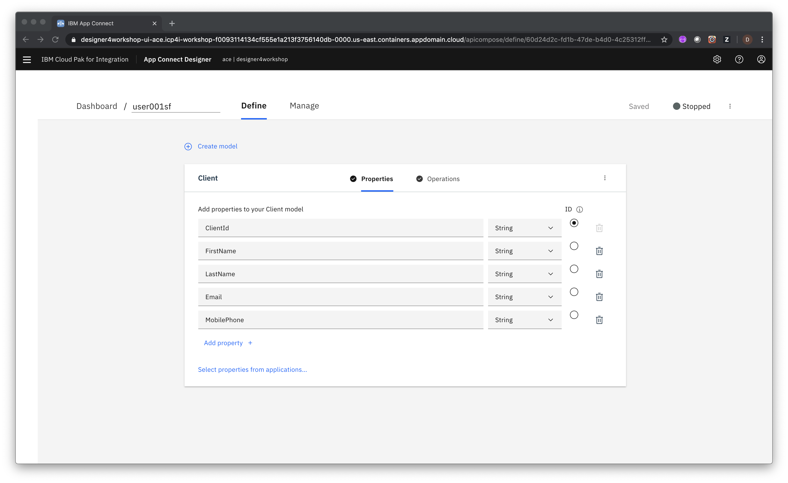

4.6 Click **Operations** and then select **Create Client**

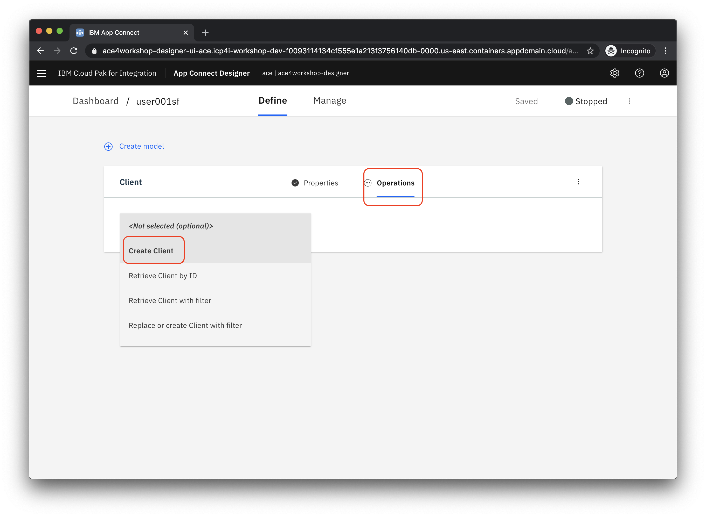

4.7 Click **Implement flow**

4.8 Click on the **+** icon.

- Scroll down to Salesforce

- Select your account from the dropdown

- Expand **Contacts**

- Click **Create Contact**


4.9 Next you'll map the properties from your model to the Salesforce Contact properties. The properties have the same names as their Salesforce equivalents so click on **Auto match fields** to complete the mapping

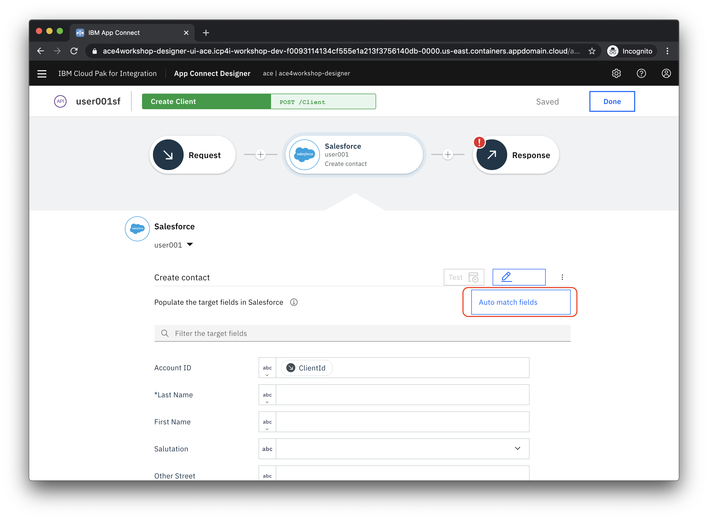

4.10 Click on **Response** to configure what will be returned by the flow. Click in the text box for the **Client Id** property and then click on the icon just to the right of the field. Select the **Contact Id** property of the Salesforce contact.

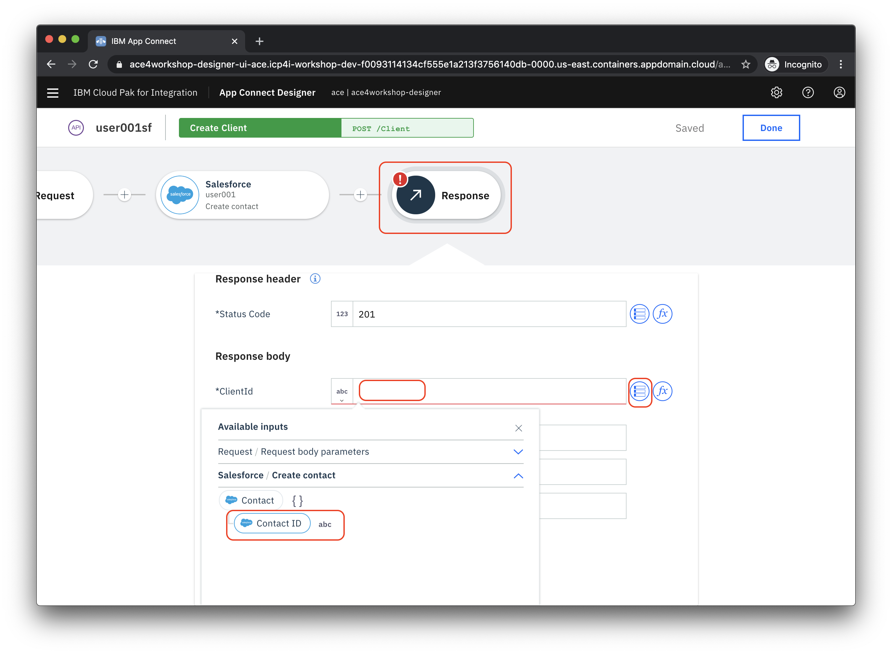

4.11 Next you'll test the flow to make sure it works. Click on the middle part of the flow and then click on the edit icon.

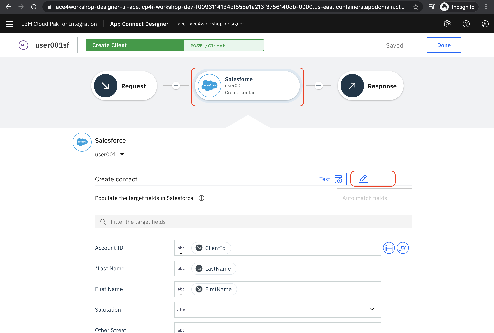

4.12 Click on **Request body parameters** and then edit the imput parameters that will be used in the test.

- Set the **Client Id** to blank. This value will be generated by Salesforce and returned.

- Enter a **FirstName** value.

- Enter a **LastName** value.

- Enter an **Email** in a valid email format

- Enter a **MobileNumber** in a valid format


4.13 Click the test icon. Verify that the operation returns a 200 HTTP status code.


4.15 Click **View details** to see the raw data returned from the call to Salesforce (note this is not the same as the data returned by the flow which you defined in the **Response** stage of the flow). Click **Done**.

4.16 Select **Retrieve Client by ID** as the next operation to add

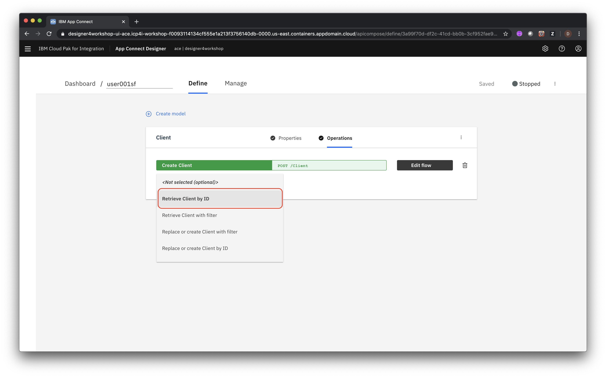

4.17 Click **Implement flow**

4.18 Click on the **+** icon.

- Scroll down to Salesforce

- Select your account from the dropdown

- Expand **Contacts**

- Click **Retrieve Contacts**

4.19 Click **Add condition +** and select the **ClientId** to be equal to the **ContactId**

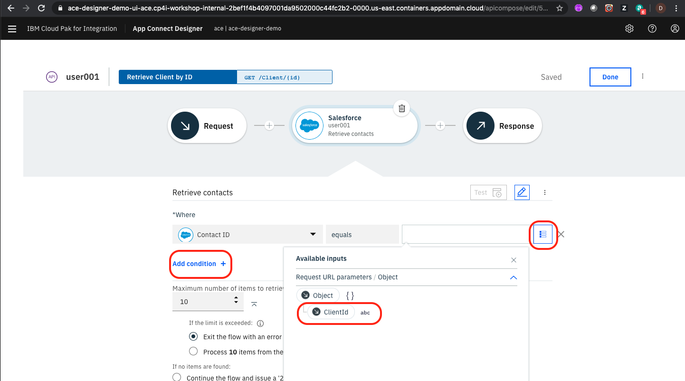

4.20 Change **Maximum number of items to retrieve** to `1`


4.21 Click on **Response** to configure what will be returned by the flow. Click in the text box for the **Client Id** property and then click on the icon just to the right of the field. Select the **Contact Id** property of the Salesforce contact.


4.22 Click **Done**

4.23 Next you'll export the flow so it can deployed in an Integration Server instance. Click the **Settings** icon and then select **Dashboard**. Click the 3 vertical dots on the tile for your new flow and select **Export ...** from the context menu.


4.24 Select **Export for integration server (BAR)** and click **Export**

4.25 Save the file to a folder of your choosing keeping the name that was pre-filled for you. (eg _user005sf.bar_).

## Section 5: Save your Salesforce credentials as an OpenShift secret

To deploy an Integration Server for your flow, you need to create a Kubernetes secret with your Salesforce credentials in the OpenShift cluster running Cloud Pak for Integration. We've created a helper app for you to do this.

5.1 In a separate browser tab, launch the helper app using the URL provided to you by the instructor. When prompted login using your workshop credentials

5.2 Enter the Salesforce authentication info requested. Note that in this UI the Salesforce password and Security Token are entered in separate fields.


5.3 Click **Save credentials**. You should see a message like the following indicating the a secret was created.


## Section 6: Create an Integration Server instance and deploy your flow

In this Step you'll create an Integration Server instance and deploy your flow to it.

6.1 In a new browser tab open the CP4I **Platform Home** URL provided to you by your instructors.

6.2 Login with your _user???_ credentials if prompted

6.3 Click on **Skip Welcome**

6.4 Click on **View instances** and then click the link for **App Connect Dashboard**

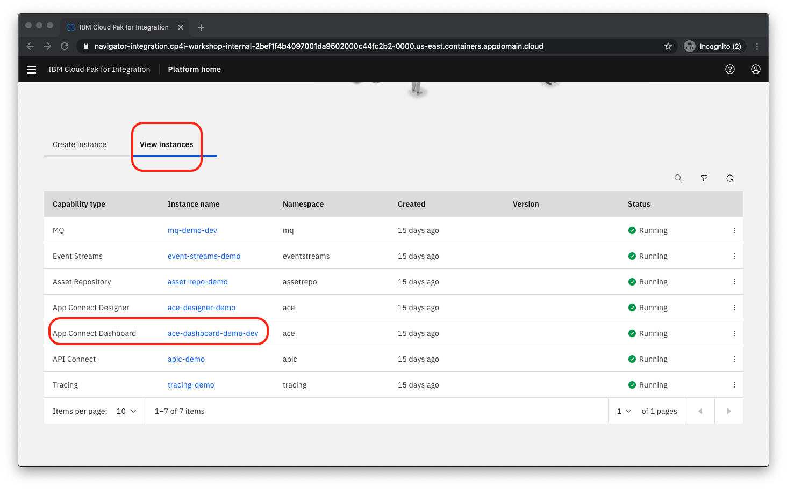

6.5 Click **Create server**

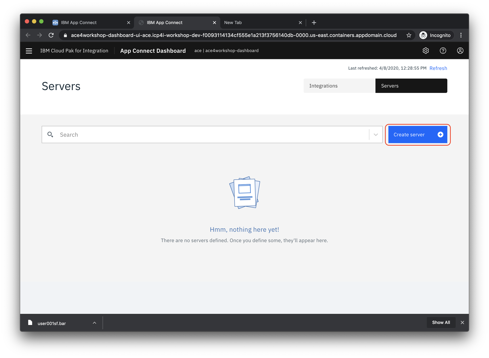

6.6 Click **Add a BAR file** and select the file you exported at the end of the previous section.

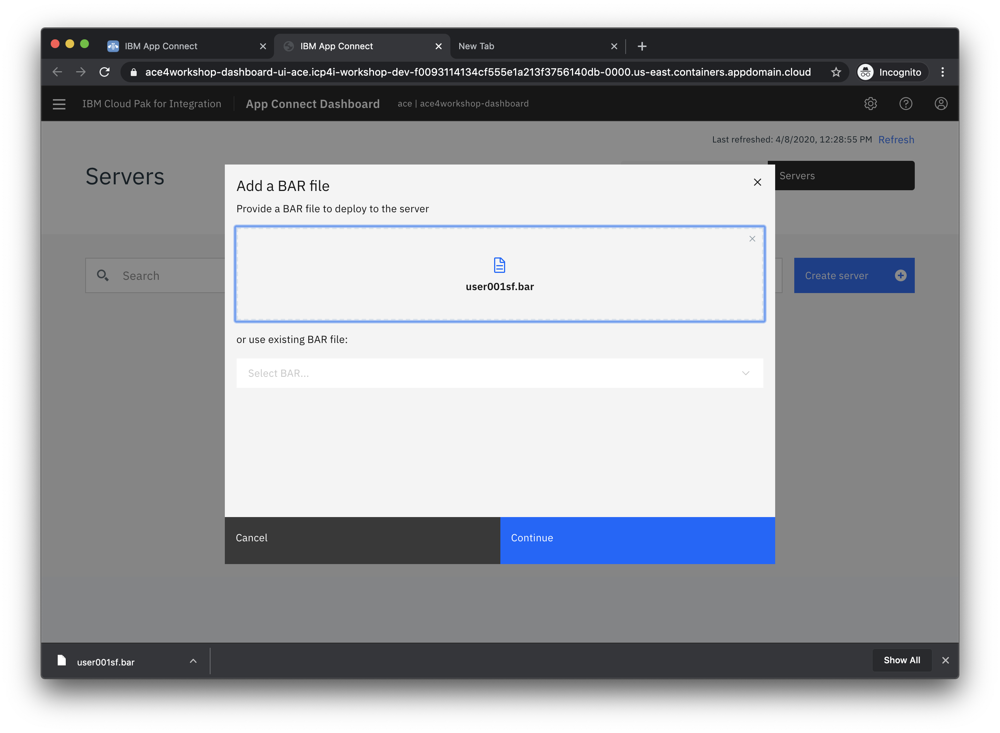

6.7 Click **Continue**.

6.8 Click **Next** (**Note:** you'll use a helper app to deploy the flow configuration so no need to download the config package).

6.9 Select **Designer** as the type of Integration that you want to run and click **Next**


6.10 Change the setting for **Show everything** to **ON**.


6.11 Enter the following settings:

- In the **Details** section for the **Name** enter `user???sf` where _user???_ is the username of your credentials (e.g. \*user005sf\*\*)

- In the **Details** section for **IBM App Connect Designer flows** select **Enabled for local connectors only**

- In the **Integration Server** section for **Name of the secret that contains the server configuration** enter `user???-sf-connect` where _user???_ is the username of your credentials (e.g. \*user005-sf-connect\*\*)

- In the **Configuration for deployments** section change the **Replica count** to 1

The top half of the dialog should look like the following:

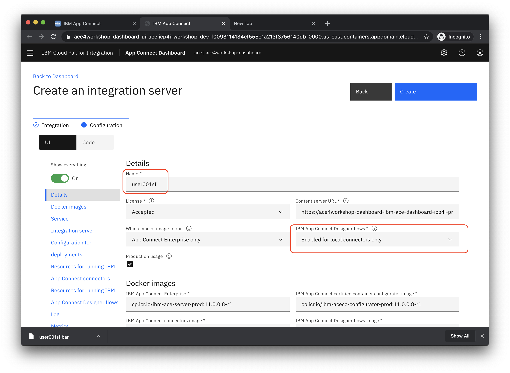

The bottom half of the dialog should look like the following:

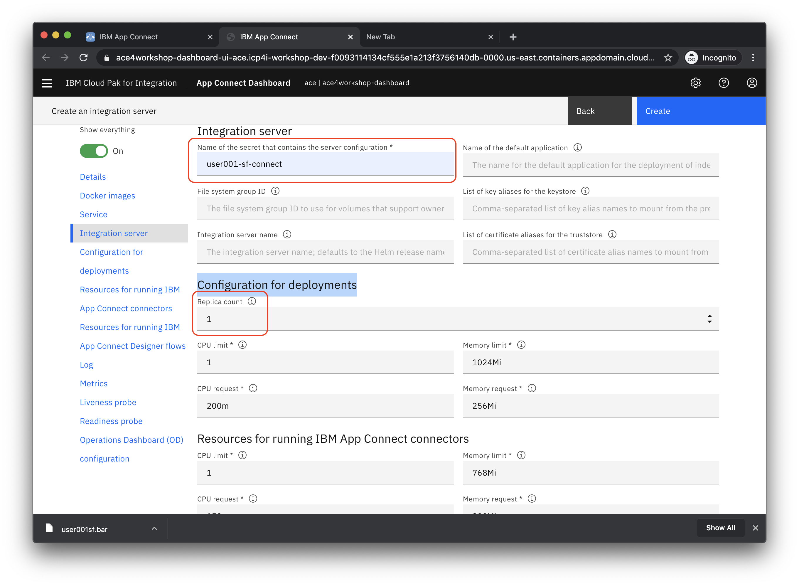

6.12 Click **Create**. The status of the server will be eventually shown. Wait until the server status shows as **Started**. Note you may have to refresh the page to see the status change.

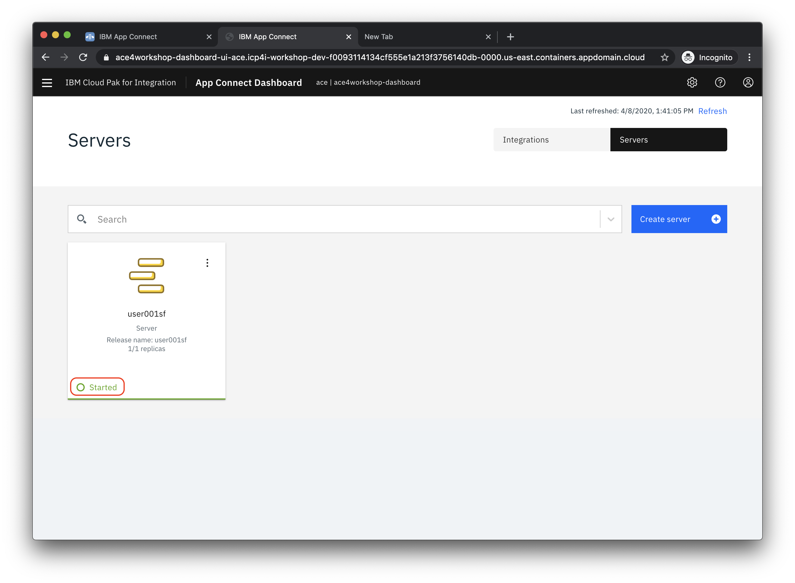

## Section 7: Get the REST endpoint of your App Connect Flow

7.1 In the App Connect Dashboard click on the tile for your new server


7.2 Click on the API tile to see the details of the flow's API

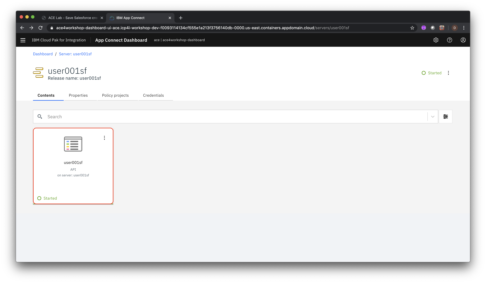

7.3 You should see the details of your flow's API

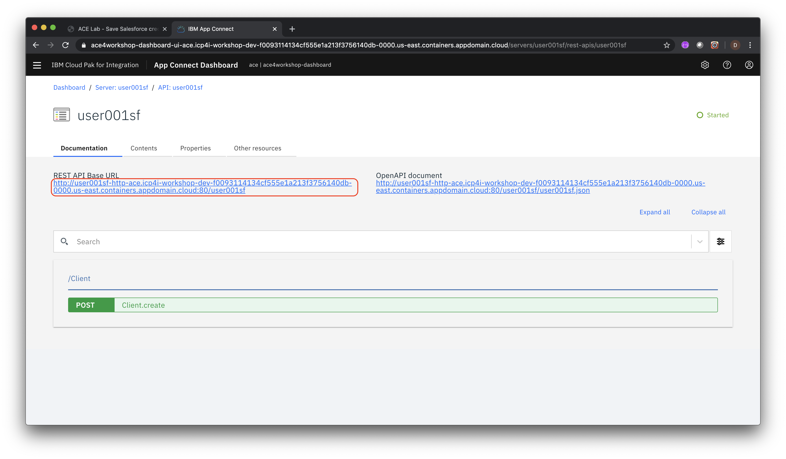

7.4 Copy the **REST API Base URL** to the clipboard

## Section 8: Test your App Connect Flow with Trader Lite


8.1 Run the following command in the chart directory with the Flow URL you copied to the clipboard:

```
helm upgrade traderlite  --set salesforceIntegration.enabled=true --set salesforceIntegration.flow.url=[YOUR FLOW URL] --reuse-values ../traderlite
```

8.3 The output should look like the following:

```
$ ./addSalesforceIntegration.sh http://user001-sf.....
Script being run from correct folder
Validating student id  ...
Verifying that Trader Lite is already installed ...
Found Trader Lite installed in this project
Updating Trader Lite with Salesforce Integration enabled ...
Salesforce Integration completed successfully

Wait for all pods to be in the 'Ready' state before continuing
```

8.4 Wait for the Portfolio pod to restart. Run the following command.

```
oc get pods
```

Repeat the command until all the pods are in the _Ready_ state as shown below:

```
NAME                                        READY   STATUS    RESTARTS   AGE
traderlite-mariadb-0                        1/1     Running   0          6m21s
traderlite-mongodb-6c79bf9554-swhvw         1/1     Running   0          6m21s
traderlite-operator-6ddd5c4774-l5dcd        1/1     Running   0          19h
traderlite-portfolio-546d45bf4f-86xqr       1/1     Running   0          3m55s
traderlite-stock-quote-7965448598-dt7vw     1/1     Running   0          6m21s
traderlite-trade-history-5648f749c4-v2w9j   1/1     Running   0          6m21s
traderlite-tradr-6cd8d879f4-tznq7           1/1     Running   0          6m21s
```

8.5 Open the Browser to the Stock Tradr Web Application.


8.6 Log in using the username `stock` and the password `trader`

8.8 Click on **Add Client**


8.9 Add the client info using valid formats for the Phone Number and email address. Click **Save**.

8.10 Click on the Portfolio ID of the added client


8.11 Click on **Client Details** and verify that the Salesforce Contact Id of the new client is shown.


8.12 Optional: Go to Salesforce and verify that a new contact was added with the details you provided.

## Summary

Congratulations ! You successfully completed the following key tasks in this lab:

- Connected to Salesforce
- Created an App Connect designer flow to push client data to Salesforce contacts.
- Deployed the flow as an Integration Server in App Connect Dashboard
- Configured a ClientID/API Key for security set up a proxy to the existing API.
- Tested the flow with the Trader Lite app.
