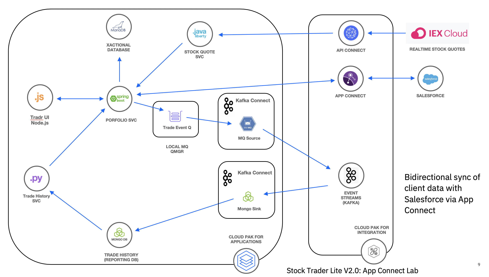
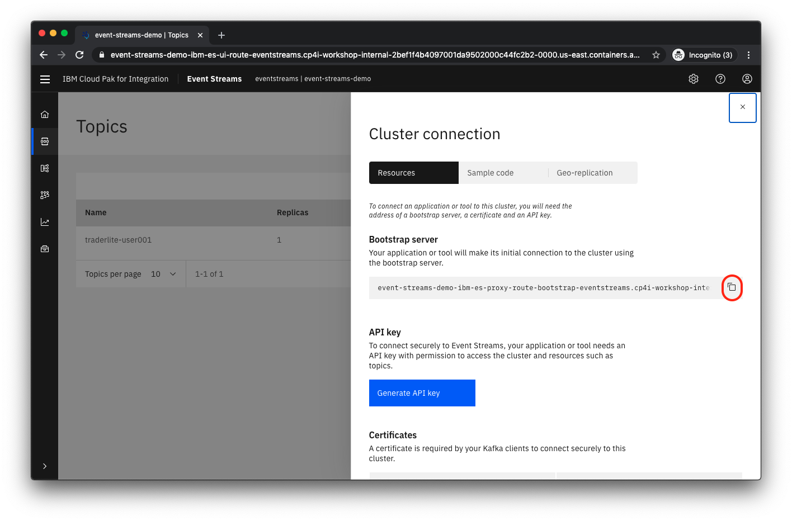
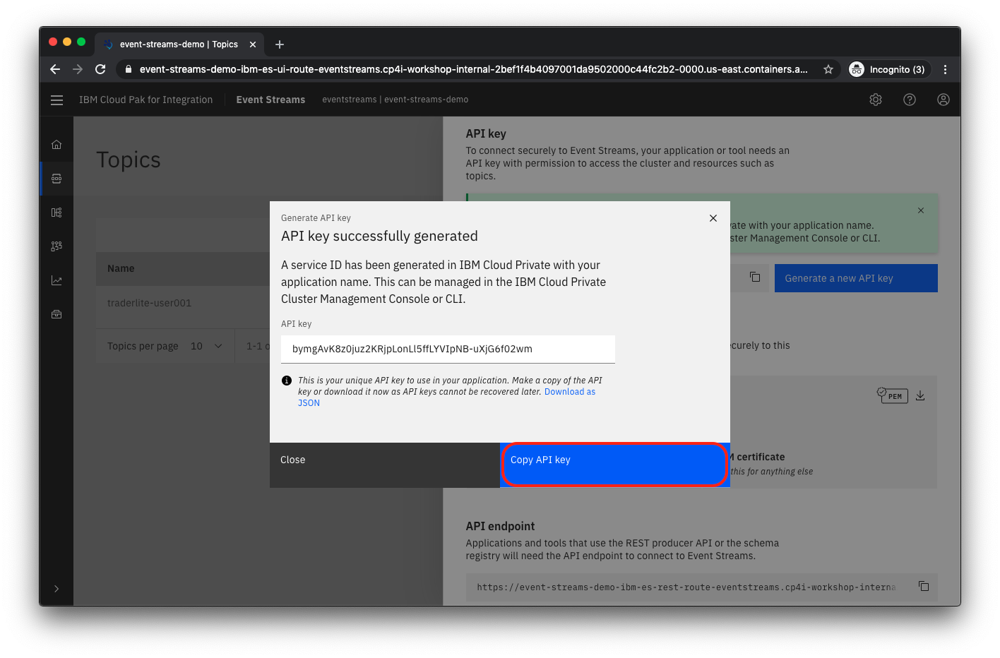
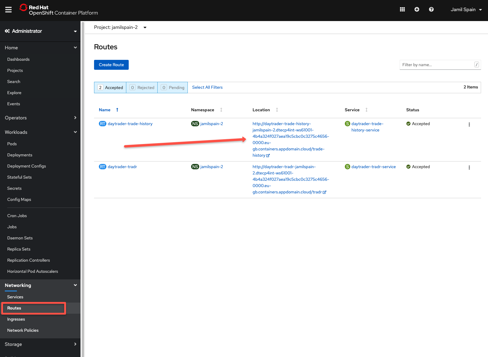

# Lab - Using IBM Event Streams for near realtime data replication

In this lab you will use IBM MQ and IBM Event Streams to replicate data from a transactional database to a reporting database. The pattern used allows for seamless horizontal scaling to minimize the latency between the time the transaction is committed to the transactional database and when it is available to be queried in the reporting database.

The architecture of the solution you will build is shown below:



- The **portfolio** microservice sits at the center of the application. This microservice:

  - sends completed transactions to a local IBM MQ queue.
  - calls the **trade-history** service to get aggregated historical trade data.

- The **Kafka Connect** source uses the Kafka Connect framework and an IBM MQ source to consume the transaction data from IBM MQ and sends it to a topic in Event Streams. By scaling this service horizontally you can decrease the latency between the time the transaction is committed to the transactional database and when it is available to be queried in the reporting database,

- The **Kafka Connect** sink uses the Kafka Connect framework and a Mongodb sink to receive the transaction data from Event Streams and publishes the data to the reporting database. By scaling this service horizontally you can decrease the latency between the time the transaction is committed to the transactional database and when it is available to be queried in the reporting database.

This lab is broken up into the following steps:

1. [Create a topic in the Event Streams Management Console](#step-1-create-a-topic-in-the-event-streams-management-console)

1. [Get credentials for your Event Streams topic](#step-2-get-credentials-for-your-event-streams-topic)

1. [Upload the Java truststore to the IBM Cloud Shell](#step-3-upload-the-java-truststore-to-the-ibm-cloud-shell)

1. [Add messaging components to the Trader Lite app](#step-4-add-messaging-components-to-the-trader-lite-app)

1. [Generate some test data with the Trader Lite app](#step-5-generate-some-test-data-with-the-trader-lite-app)

1. [Verify transaction data was replicated to the Trade History database](#step-6-verify-transaction-data-was-replicated-to-the-trade-history-database)

1. [Examine the messages sent to your Event Streams topic](#step-7-examine-the-messages-sent-to-your-event-streams-topic)

1. [Summary](#summary)

## Step 1: Create a topic in the Event Streams Management Console

Before we get started with configuring Event Streams, let's add some information to the our application to make it aware of the MQ Instance running in Cloud Pak for Integration. We need to gather the following information:

Name  | Value 
------------- | ------------- 
Queue Name   | [name].EVENT.QUEUE    
Queue Manager    | [queue mgr name]   
Queue Listener Svc    | [mq-service-name].mq.svc   
Channel    | DEV.APP.SVRCONN   

Once we have this information, let's run the helm upgrade to activate some config map data. 

```
helm upgrade [release-name]  --set mqIntegration.enabled=true --set salesforceIntegration.flow.url=[YOUR FLOW URL] --reuse-values . --namespace [openshift-project]
```

Now you can continue on with the Event Streams Configuration. 


1.1 In a new browser tab open the CP4I **Platform Home** URL provided to you by your instructors.

1.2 Login with your **OpenLDAP** credentials

1.3 Click on **Skip Welcome**

1.4 Click on **View instances** and then click the link for Event Streams


1.5 Click on the **Create a topic** tile


1.6 Name the topic `traderlite-[OpenLDAP username]` where `OpenLDAP username` is your assigned credentials. For example if your username is `jamilspain` then name the topic `traderlite-jamilspain`. Click **Next**.

1.7 Leave the default for the number of partitions and click **Next**.

1.8 Leave the default for message retention and click **Next**.

1.9 Change the Replication factor to 1 and click **Create topic**.


1.10 You should see your new topic listed.

## Step 2: Get credentials for your Event Streams topic

2.1 From the Event Streams Management Console click **Connect to this cluster**.


2.2 Click on the icon next to the **Bootstrap server** hostname to copy it to the clipboard.



2.3 Create a local file and paste the bootstrap server hostname into it. You'll need this later to connect the Stock Trader Lite application to your Event Streams topic.

2.4 Click **Generate API key**


2.5 Name the application `traderlite-app-[OpenLDAP username]` where `OpenLDAP username` is your assigned OpenLDAP username. For example if your OpenLDAP username is `jamilspain` then name the application`traderlite-app-jamilspain`.

2.6 Select **Produce, consume, create topics and schemas** for the capabilities of the API Key. Click **Next**.


2.7 Select all topics. Click **Next**.


2.8 Click **Generate API key**

2.9 Click **Copy API key** and paste the API Key into the same file that you used to save the bootstrap hostname.



2.10 Click on the download icon to download the Java truststore needed for Java applications to connect to Event Streams


2.11 This will prompt you to save the file **es-cert.jks** locally. Save the file.

2.12 Keep this browser tab open for later on in the lab.

## Step 3: Upload the Java truststore to the IBM Cloud Shell

3.1 In the IBM Cloud Shell browser tab, click on the upload icon


3.2 Select the file **es-cert.jks** that you downloaded in the previous step and follow the prompts to upload it to the IBM Cloud Shell.

3.3 In your OpenShift Project, we need to create a secret. Use the following command to create a secret in the project space.

```
oc create secret generic kafkaconnect-keystore --from-file=es-cert.jks=[path-to-es-cert.jks]
```

## Step 4: Add messaging components to the Trader Lite app

4.1 Upgrade Trader Lite Helm chart with Kafka Integration enabled.

```
helm upgrade traderlite --set kafkaIntegration.enabled=true --set global.kafkaAccess.apiKey=[KAFKA API-KEY] --set global.kafkaAccess.topic=[KAFKA-TOPIC-NAME] --set global.kafkaAccess.bootstrapHost=[KAFKA-BOOTSTRAP-SERVER]  --reuse-values ../traderlite
```

The output should look like the following:

```

```

4.2 Wait for all the pods to start. Run the following command.

```
oc get pods
```

Repeat the command until all the pods are in the _Ready_ state as shown below:

```

```

## Step 5: Generate some test data with the Trader Lite app

5.2 OPEN the Stock Tradr Web Application in your browser.

5.3 Log in using the username `stock` and the password `trader`

5.4 Click on **Add Client**


5.5 Add the client info using valid formats for the Phone Number and email address. Click **Save**.

5.6 Click on the Portfolio ID of the added client


5.7 Click **Buy Stock**. Select a company and enter the number of shares. Click **Buy shares**.

5.8 Do 2 or 3 more transactions (either buy or sell).


## Step 6: Verify transaction data was replicated to the Trade History database

6.1 From the OpenShift Console inside your Project, use the Networking -> Routes links to grab the route to your History Service.



6.2 Copy the URL that is output and access it with your browser

```
[HISTORY SERVICE ROUTE]/trades/1000
```

6.3 Verify that trade data in JSON format is shown and the **xactionsrc** fields is set to `Event Streams` indicating that this data was propagated to the Trade History database via IBM MQ and Event Streams.


## Step 7: Examine the messages sent to your Event Streams topic

In this step you'll examine the data sent to your Event Streams topic.

7.1 From the Event Streams Management Console click on the topics icon


7.2 Click on your topic name


7.3 Click on **Messages** and then select an individual message to see the details.


7.4 Details of the message you selected should appear at the right


## Summary

Congratulations ! You successfully completed the following key steps in this lab:

- Created an Event Streams topic
- Retrieved all the credentials needed to access the topic from an application .
- Configured the Trader Lite app to use your topic
- Generated transactions in the Trader Lite app and verified that the data is being replicated via Event Streams.
- Examined messages sent to your topic in the Event Streams Management console.
