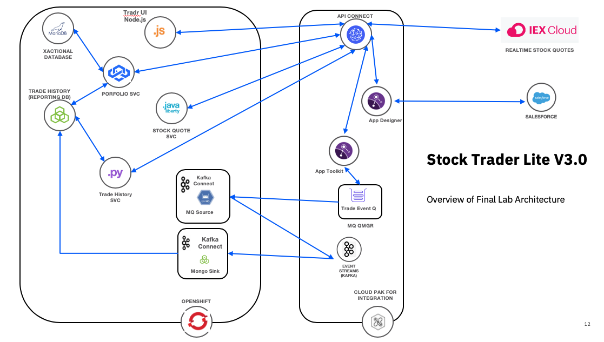

# AMI Workshop Scenario Lab: Stock Trader Lite

This is the Scenario Lab Guide for the Stock Trader Lite Application. Please view the following diagram below for the final architecture of what we will be building.

### Pre-requisites for the Lab

You will need the following utilities to be productive in this lab. 

* ibmcloud CLI -  <https://cloud.ibm.com/docs/cli>
* oc CLI  -  <https://docs.openshift.com/container-platform/4.2/cli_reference/openshift_cli/getting-started-cli.html>

* helm3 - <https://helm.sh/docs/intro/install/>